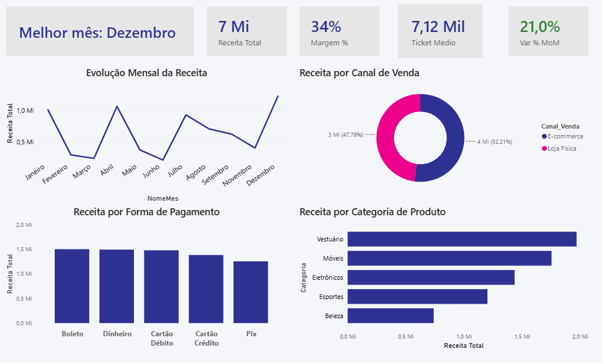
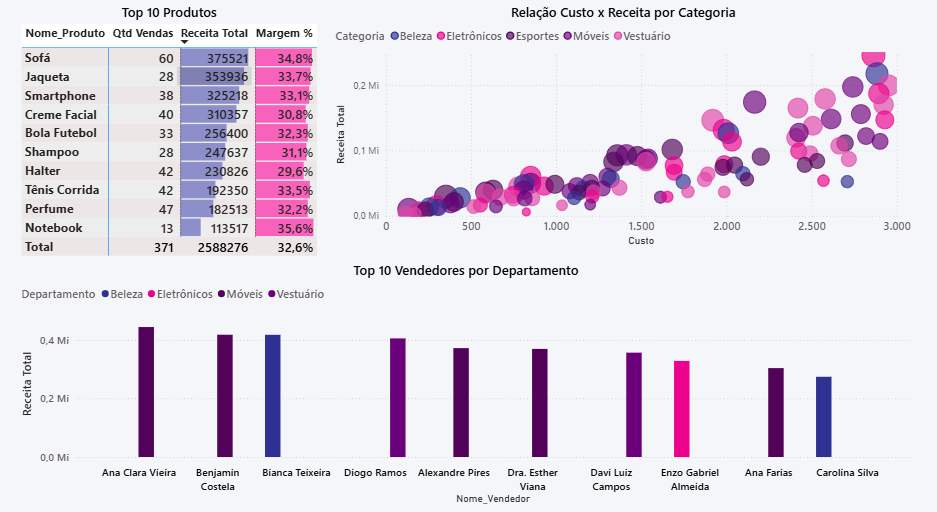
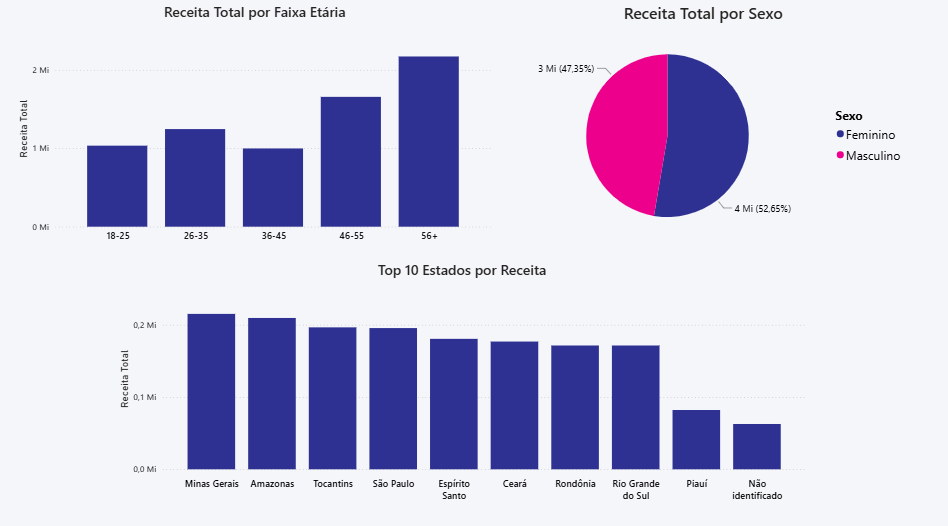

# 📊 Análise de Vendas — Loja de Departamentos

Dashboard interativo em Power BI para análise de desempenho comercial de uma loja de departamentos ao longo de 2024, cobrindo receita, margem, canais de venda e perfil de clientes.

## 🎯 Objetivo

Simular um cenário real de análise de dados de varejo, desde o tratamento de uma base bruta (com inconsistências reais de digitação, duplicatas e valores nulos) até a entrega de um dashboard interativo pronto para apoiar decisões de negócio.

## 🛠️ Ferramentas

Power BI Desktop · Power Query (linguagem M) · DAX

## 🔄 Processo

**1. Extração**
Base de dados relacional em Excel — 4 tabelas em esquema estrela (Vendas, Produtos, Clientes, Vendedores), 998 transações ao longo de 2024.

**2. Tratamento (Power Query)**
- Padronização de texto (capitalização inconsistente em formas de pagamento e cidades)
- Remoção de linhas duplicadas (identificadas por `ID_Venda`)
- Tratamento de valores nulos (descontos e estados não informados)
- Criação de colunas calculadas: `Valor_Total`, `Idade`, `Faixa_Etaria`, `Estado_Nome`
- Construção de tabela Calendário dedicada (M language), com colunas de Ano, Mês, Trimestre e Dia da Semana

**3. Modelagem**
Relacionamentos 1:N entre a tabela fato `Vendas` e as dimensões `Produtos`, `Clientes`, `Vendedores` e `Calendario`, seguindo o padrão de esquema estrela.

**4. Medidas DAX**
13 medidas cobrindo receita, margem, inteligência de tempo (variação mês a mês, YTD), ranking e participação percentual — [ver documentação completa](documentacao/medidas_dax.md).

**5. Visualização**
Dashboard com 3 páginas interativas e interações cruzadas nativas entre todos os visuais (sem uso de segmentadores redundantes — os próprios gráficos funcionam como filtro ao clicar).

## 📈 Principais Insights

- **Crescimento de 21% em dezembro** frente ao mês anterior — o pico mais forte do ano
- **Canais de venda quase equilibrados**: Loja Física responde por 52,2% da receita contra 47,8% do E-commerce, sem um canal dominar o outro
- **Departamento de Móveis se destaca de forma consistente**: 3 dos 10 vendedores com maior receita pertencem a esse departamento, indicando performance de equipe, não de indivíduos isolados
- **Clientes 56+ geram a maior receita entre todas as faixas etárias**, sugerindo um público de maior poder de compra ou fidelidade a explorar em estratégias futuras
- Margem média de **32,6%** entre os 10 produtos mais vendidos, com o Sofá liderando em receita absoluta

## 🖼️ Preview

🎥 [Veja o dashboard em ação](imagens/video_interatividade.mp4) (demonstração de interatividade)

## 📁 Como usar

Baixe `dashboard.pbix` e abra no Power BI Desktop (versão 2023 ou superior) para explorar interativamente. A base de dados original (com as inconsistências tratadas ao longo do processo) está disponível em `/dados`.

## 📌 Sobre o tratamento de dados

Este projeto usa uma base de dados intencionalmente imperfeita (duplicatas, nulos e inconsistências de formatação) para simular um cenário real de tratamento de dados — o processo completo de correção está documentado nas etapas do Power Query descritas acima.

---

Desenvolvido por Ester Rodrigues da Silva · [LinkedIn](https://www.linkedin.com/in/esterrds)
